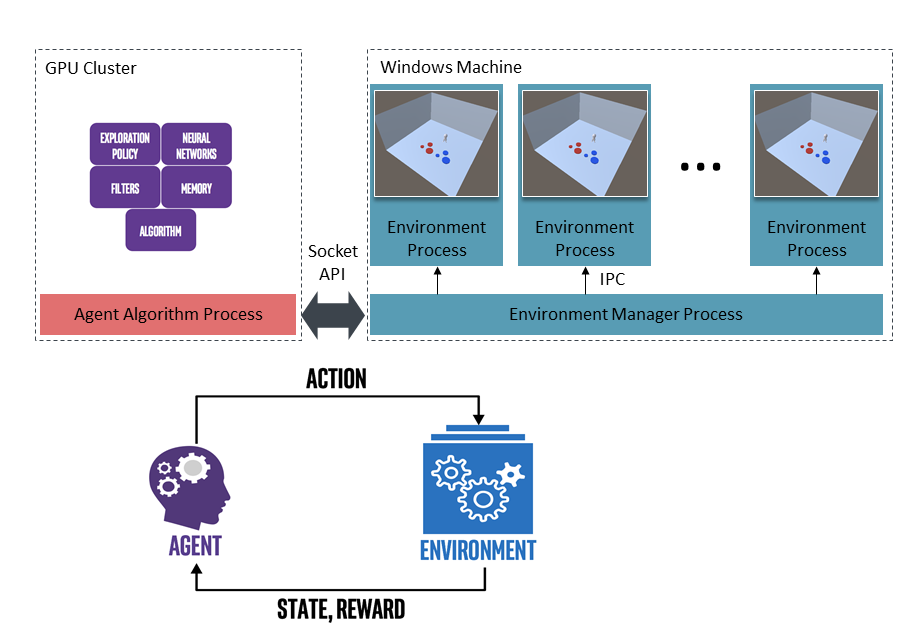

# VECA

[](https://opensource.org/licenses/MIT) 



## Prerequisite

VECA environment requires two separate terminal sessions to properly execute it. One is to execute `Unity3D-based Environment` (*Environment* from now on), and the other is to execute the `agent algorithm` (*Algorithm* from now on). A session executing the environment should be executed on `Windows OS`. 

Two sessions need not be on the same machine, since the communication between the environment and algorithm is socket-based. So the environment can run on Windows desktop, and the agent algorithm can run on linux cluster server. To sum up, the OS requirement is as follows:

* Environment session: Windows OS 

* Algorithm session: Any OS supporting python3 

You need python3 and ffmpeg to execute scripts. In Ubuntu, you can install them with following command.
```
sudo apt install python3 ffmpeg
```

You also need 3 python packages numpy, moviepy, and pillow. You can install them with following command.
```
pip install numpy moviepy pillow
```
or use `requirements.txt` file to install as follows:
```
pip install -r requirements.txt
```

## Installation

1. Clone this veca repository. Both the *environment* and *algorithm* session should clone it.
```
git clone https://github.com/GGOSinon/VECA.git
```

2. (Only for the *environment* session) Create `bin` directory inside the repository, 
```
mkdir bin && cd bin
```
and download the zip file `disktower.zip` containing a unity application executable. 

* click [google drive link](https://drive.google.com/file/d/1mQEpN0wqztujGxtyYxARv_c_fxCAmIey/view?usp=sharing) to download, 
* OR use [gdown](https://github.com/wkentaro/gdown) program to download from the commandline.

```
gdown https://drive.google.com/uc?id=1mQEpN0wqztujGxtyYxARv_c_fxCAmIey

```


3. (Only for the *environment* session) unzip the downloaded zip file, and go back to root directory of the repo.

```
unzip disktower.zip
cd ../
```

### Other tasks 
Unity application executables for tasks besides DiskTower are available in the following google drive links. Download and unzip it on a different directory. Modify an unity executable path in the `env_manager.py` script to use it.

* KickTheBall task: [google drive link](https://drive.google.com/file/d/1jIxQyA2rS54-XH_AQxfWXRJqcYepMZ_T/view?usp=sharing)
* MazeNav task: [google drive link](https://drive.google.com/file/d/1SSsQIklTFChWRvR14aRB9lTzMgMdPorv/view?usp=sharing)
* BabyRun task: [google drive link](https://drive.google.com/file/d/1LZYNrQ8JUQEgT-rx_pTs_clwzeOHXqlI/view?usp=sharing)

## Usage

The configuration of each script can be altered in two ways: modify a default config inside the script; or specify the optional argument on execution.

NOTE:
* env_manager.py should be executed **before** the algorithm.py
* IP and ALGO_PORT of algorithm.py should match the ip and port of env_manager.py script's machine IP and ALGO_PORT.

The environment manager can be executing using this command.
```
python env_manager.py
```
Configuration of environment e.g., number of parallel environments, ip and port of algorithm server, can be altered.
```
usage: env_manager.py [-h] [--executable EXECUTABLE] [--port PORT]

VECA Environment Manager

optional arguments:
  -h, --help            show this help message and exit
  --executable EXECUTABLE
                        Unity Executable Path
  --port PORT           Port exposed for algorithm
```

The agent algorithm can be executed using this command.

```
python algorithm.py
```

Configuration of algorithm e.g., number of parallel environments, port of algorithm server, can be altered.
```
usage: algorithm.py [-h] [--ip IP] [--port ENV_PORT] [--num_envs NUM_ENVS]

VECA Algorithm Server

optional arguments:
  -h, --help           show this help message and exit
  --ip IP              Envionment Manager machine's ip
  --port ENV_PORT      Environment Manager's port
  --num_envs NUM_ENVS  Number of parallel environments to execute
```
