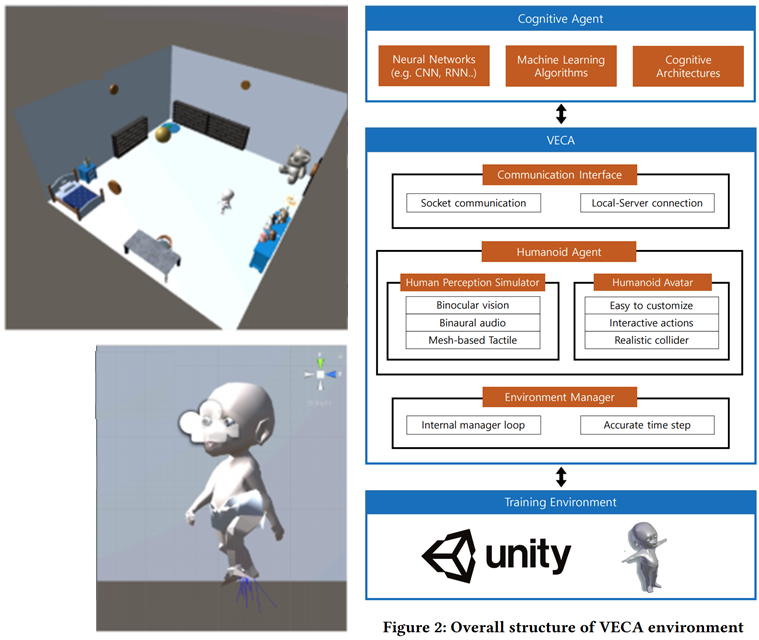

# VECA (VR Toolkit for Training and Testing Cognitive Agents)

## Notification

This repository currently only contains examples of VECA, i.e. doesn't contain any main codes of VECA.

That is, installing and making custom environments with VECA is **currently not available**. (End-user examples are available.)

## Contents

<!--
In-document header reference should be preceded with hashtag, then each alphabets lower cased, and each space substituted as hyphen(-). Header should not include characters other than alphabet or number.
-->

* [Introduction](#introduction)
* [Installation](#installation)
* [Usage and Tutorial](#usage-and-tutorial)
* [Documentation](#documentation)


## Introduction

The concept of cognitive agent, capable of acting and interacting with an environment for cognitive development and learning, is receiving increasing attention as a way to overcome the limitations of deep learning algorithms.
However, it is extremely challenging to develop such cognitive agents due to a lack of tools to train and test them. 
In this paper, we propose a novel VR-based toolkit, VECA, which enables to train and test cognitive agents in a virtual environment. 
In particular, VECA provides a virtual humanoid avatar with rich human-like perceptions and an environment for the agent to interact, with which development of cognitive agents can be facilitated. 
Our preliminary evaluation shows that the agent trained with rich perceptions can achieve higher learning performance for the task to kick a ball, while the agent with a single perception fails to learn certain interaction patterns thereby getting lower performance. 



## Installation (Currently not available)

### VECA-unity

1. Install Unity from https://unity.com. (Please note that current VECA-unity is built in version 2019.1.10f1. We recommend to install "Unity hub" from [here](https://unity3d.com/get-unity/download) which can install multiple unity versions easily.)

2. Download the [Asset.zip], and unzip it to create the Assets folder. 
 
3. Make a blank unity project and replace the whole *Assets* folder with the downloaded *Assets* folder. 

4. Turn off the unity editor and restart it, then it would recognize the change and reimport all the assets. If something goes wrong, use `Assets > Reimport All` of the option menu. It may take some time(~10 min)

4. Go to  `Window > Package Manager`  of the menu and switch the view from  `In Project`  to  `All Packages`. Select `Postprocessing` in the list and install. 

### VECA-python

You can install VECA-python by building it from source. Download and install using:


```console
$ git clone https://gitlab.com/hcslab/babymind/veca.git
$ cd VECA/python/VECA-python/
$ pip install -e .

```

## Usage and Tutorial


### VECA-unity (VECA & Training Environment)

For tutorial, let's use the KickTheBall environment. 
It is in the Assets/Examples/KickTheBall folder, 
and you can open it by double-clicking the *KickTheBallScene* scene in the unity project structure. 
Then you will see the baby agent standing middle of the room.

Now next step is to.... run! 
Just run the scene with the play button in the top of the unity editor. 
You can control the baby using keyboards : 
W/S/Q/E/A/D makes the baby go forward/go back/rotate left/rotate right/walk left/walk right. 
If the baby goes in front of the ball, it kicks the ball automatically. 
Have some fun! :smile:

#### How to Build Application

To integrate VECA-unity environment with VECA-python, you have to build the application from the scene. 
Go to `File > Build Settings` and choose your platform. Press `Build` and choose the build output directory. 

Please note that executable application depends on the target platform. In specific:

* Windows - ApplicationName.exe 
* MacOS - ApplicationName
* Linux - ApplicationName

You may execute those in commandline with arguments such as:

```console
$ ./ApplicationName -debug
```

#### [Tutorial](unity/tutorial.md)

We provide you the tutorial of the internal logic of unity-side implementation.
You can refer it to understand it and do a further tweak or customization of the unity-side implementation.

### VECA-python (Cognitive Agent)

For server-side python code, import and inherit the GeneralEnvironment class, as following, to suit your need. Refer to `python/Example/KickTheBallEnv.py` for exemplar usage.

```python
from environment import GeneralEnvironment

class MyEnvironment(GeneralEnvironment):
    ...
```

The common practice is to only override the *step* function of the *GeneralEnvironment* class.

#### [Tutorial](python/tutorial.md)

We provide you the tutorial of how to use the OpenAI gym-like python-side Environment.


## [Documentation](documentation.md)

We provide you a detailed documentation of VECA APIs, and the description of current repository directory structure.
